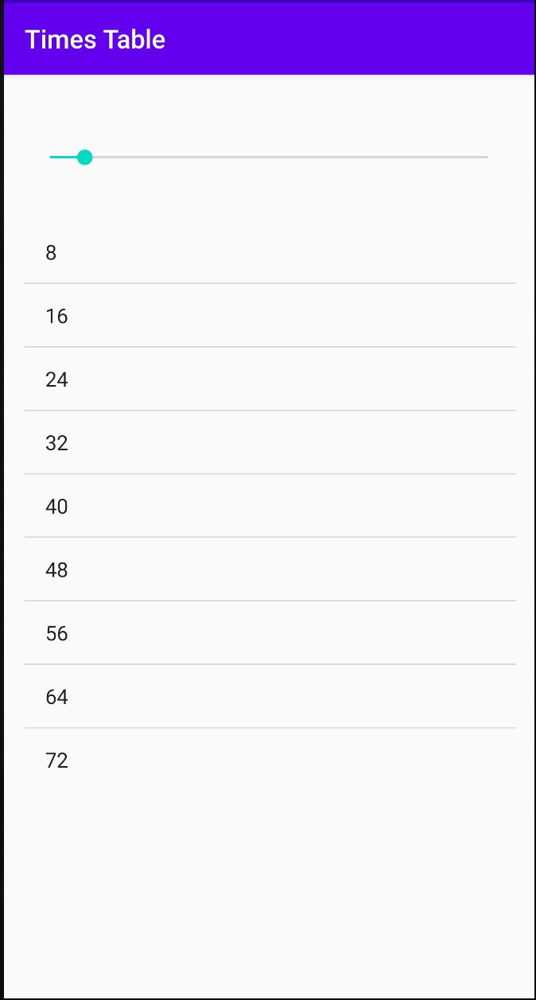
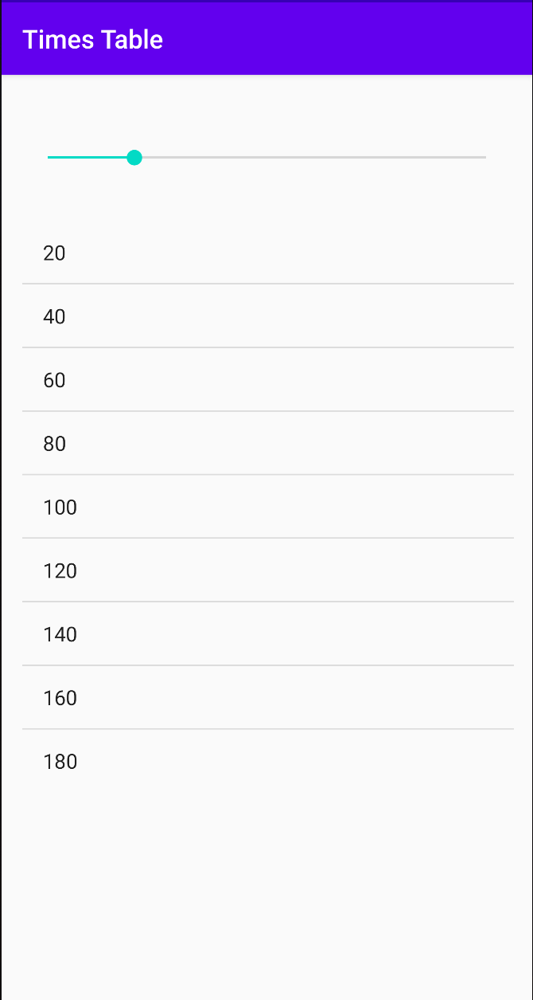
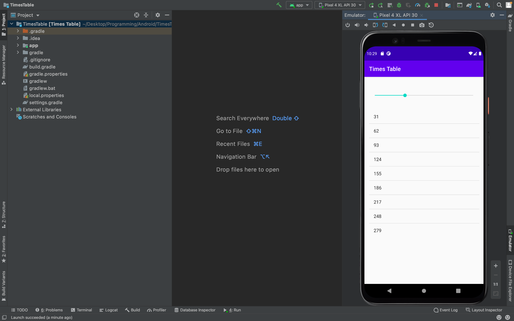

# Times-Table-Application
An Android application that displays the multiplication table for all the numbers from 1 to 101.

## Default Screen (Landing Page)

## Using the Slider to see the Table of 20

## Using the Slider to see the Table of 31

## Using the Slider to see the Table of 45

## Using the Slider to see the Table of 67

